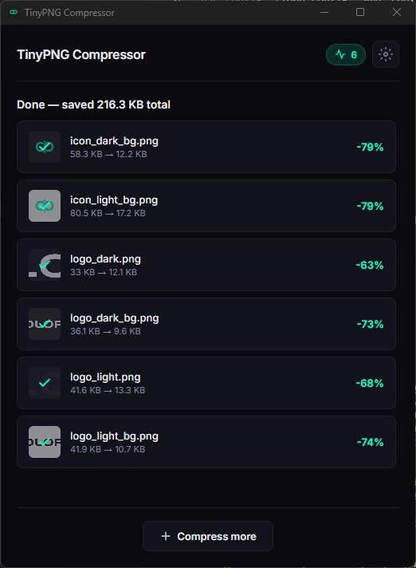

# TinyPNG Compressor

A lightweight Windows desktop app for compressing images using the [TinyPNG API](https://tinify.com/developers). Built with **Tauri v2** (Rust + HTML/CSS/JS).



## Features

- **Drag & drop** — Drop images directly onto the app to compress
- **Image previews** — See thumbnails and per-file progress in real time
- **Windows "Send To"** — Right-click images in Explorer → Send to → TinyPNG Compressor
- **Smart output** — Saves to a `compressed/` subfolder by default, or pick your own
- **Persistent settings** — API key, output directory, and usage count saved across sessions
- **Portable** — Single `.exe`, no installation required

**Supported formats:** PNG, JPEG, WebP, AVIF

## Download

Grab the latest release from the [Releases page](https://github.com/lsparagino/olopad-tinypng/releases).

| File | Description |
|------|-------------|
| `tinypng-compressor.exe` | Portable — just run it |
| `TinyPNG Compressor_x64-setup.exe` | NSIS installer |
| `TinyPNG Compressor_x64_en-US.msi` | MSI installer |

## Getting Started

1. Download and run the app
2. Enter your [TinyPNG API key](https://tinypng.com/developers) (free, 500 compressions/month)
3. Drop images or click to browse — done!

## Windows "Send To"

### Automatic (in-app)

Open Settings → click **Install** to add the shortcut.

### Manual setup

1. Press `Win + R`, type `shell:sendto`, press Enter
2. Copy `tinypng-compressor.exe` (or create a shortcut to it) into the folder
3. Rename it to `TinyPNG Compressor` (optional)

---

## Development

### Prerequisites

- [Rust](https://rustup.rs/) (1.70+)
- [Node.js](https://nodejs.org/) (18+)
- [Microsoft Visual Studio C++ Build Tools](https://visualstudio.microsoft.com/visual-cpp-build-tools/)

### Setup

```powershell
npm install
```

### Run Locally

```powershell
npm run tauri dev
```

### Build for Production

```powershell
npm run tauri build
```

### Bump Version

```powershell
npm run bump 1.0.0
```

Updates `package.json`, `tauri.conf.json`, and `Cargo.toml`. The About section reads the version dynamically.

### Regenerate Icons

```powershell
npx -y @tauri-apps/cli@latest icon icon_dark_bg.png
```

## Project Structure

```
├── src/                    # Frontend (HTML/CSS/JS)
│   ├── index.html
│   ├── styles.css
│   ├── main.js
│   └── assets/logo.svg
├── src-tauri/              # Rust backend
│   ├── src/
│   │   ├── main.rs         # Entry point
│   │   ├── lib.rs          # Tauri commands
│   │   ├── api.rs          # TinyPNG API client
│   │   └── config.rs       # Persistent config (%APPDATA%)
│   ├── Cargo.toml
│   └── tauri.conf.json
├── scripts/
│   └── bump-version.js     # Version bump utility
├── logo_dark.svg           # Source logo
└── icon_dark_bg.png        # Source icon
```

## Configuration

Settings are stored in `%APPDATA%/tinypng-compressor/config.json`:

- **API Key** — get one free at [tinypng.com/developers](https://tinypng.com/developers)
- **Output directory** — defaults to a `compressed/` subfolder next to source files

## License

Powered by [OloPad](https://olopad.com) · © 2026 OloPad. All rights reserved.
